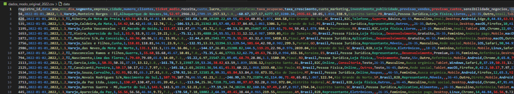

# Exemplos Prompts a serem utilizados nos modos "Original" e "Modo Hotel Único"

- **Modo Original:** Para dados agregados de vários segmentos.

- **Modo Hotel Único:** Para dados detalhados de um único hotel, com as métricas diárias agregadas necessárias para dashboards de Revenue Management.

Basta executar o main.py com o parâmetro --modo_hotel_unico para usar o novo modo, ou sem ele para usar o modo original.

Cada comando utiliza parâmetros diferentes (número de registros, segmentos, intervalo de datas, probabilidade de outliers e nome do arquivo de saída) para ilustrar a flexibilidade do sistema
Cada comando exemplifica uma execução diferente do script, permitindo testar a geração de datasets com configurações variadas e, assim, atender a diferentes necessidades de simulação e análise.

## Exemplos do Modo Original (Dados Agregados de Vários Segmentos)

### Exemplo 1: segmentos Varejo e TI

python main.py --registros 3000 --segmentos "Varejo" "TI" --data_inicio 2022-01-01 --data_fim 2022-12-31 --outliers 0.02 --arquivo_saida "dados_modo_original_2022.csv"

### Exemplo 2: segmentos Hotelaria, Finanças e Indústria

python main.py --registros 5000 --segmentos "Hotelaria" "Finanças" "Indústria" --data_inicio 2020-01-01 --data_fim 2024-12-31 --outliers 0.03 --arquivo_saida "dados_agrupados_multisegmento.csv"

### Exemplo 3: segmentos Educação e Serviços

python main.py --registros 1000 --segmentos "Educação" "Serviços" --data_inicio 2021-06-01 --data_fim 2021-12-31 --outliers 0.01 --arquivo_saida "dados_servicos_educacao.csv"

### Exemplo 4: segmentos Consultoria e TI

python main.py --registros 2000 --segmentos "Banco" "Consultoria" "TI" --data_inicio 2019-01-01 --data_fim 2019-12-31 --outliers 0.04 --arquivo_saida "dados_banco_consultoria.csv"

### Exemplo 5: segmentos Aviação, Automobilismo e Finanças

python main.py --registros 4000 --segmentos "Aviação" "Automobilismo" "Finanças" --data_inicio 2018-01-01 --data_fim 2020-12-31 --outliers 0.05 --arquivo_saida "dados_multisegmento_varios.csv"

### Exemplo 6: Dados para Varejo e Hotelaria em 2021

python main.py --registros 1000 --segmentos "Varejo" "Hotelaria" --data_inicio 2021-01-01 --data_fim 2021-12-31 --outliers 0.02 --arquivo_saida "dados_varejo_hotelaria_2021.csv"

### Exemplo 7: Dados para TI e SaaS entre 2020 e 2022

python main.py --registros 2000 --segmentos "TI" "SaaS" --data_inicio 2020-06-01 --data_fim 2022-06-01 --outliers 0.03 --arquivo_saida "dados_ti_saas_2020-2022.csv"

### Exemplo 8: Dados para Finanças, Aviação e Automobilismo de 2019 a 2023

python main.py --registros 5000 --segmentos "Finanças" "Aviação" "Automobilismo" --data_inicio 2019-01-01 --data_fim 2023-12-31 --outliers 0.05 --arquivo_saida "dados_financas_aviação_automobilismo.csv"

### Exemplo 9: Dados para Indústria e Metalurgia entre 2022 e 2024

python main.py --registros 3000 --segmentos "Indústria" "Metalurgia" --data_inicio 2022-01-01 --data_fim 2024-01-01 --outliers 0.04 --arquivo_saida "dados_industria_metalurgia.csv"

### Exemplo 10: Dados para Saúde e Hospital entre 2020 e 2022

python main.py --registros 4000 --segmentos "Saúde" "Hospital" --data_inicio 2020-03-01 --data_fim 2022-03-01 --outliers 0.06 --arquivo_saida "dados_saude_hospital.csv"

### Exemplo 11: Dados para Comércio e Serviços de 2021 a 2023

python main.py --registros 2500 --segmentos "Comércio" "Serviços" --data_inicio 2021-05-01 --data_fim 2023-05-01 --outliers 0.01 --arquivo_saida "dados_comercio_servicos.csv"

### Exemplo 12: Dados para Aviação, Finanças e Varejo de 2018 a 2020

python main.py --registros 3500 --segmentos "Aviação" "Finanças" "Varejo" --data_inicio 2018-01-01 --data_fim 2020-12-31 --outliers 0.07 --arquivo_saida "dados_aviação_financas_varejo.csv"

### Exemplo 13: Dados para TI e Consultoria entre 2022 e 2023

python main.py --registros 1500 --segmentos "TI" "Consultoria" --data_inicio 2022-07-01 --data_fim 2023-07-01 --outliers 0.03 --arquivo_saida "dados_ti_consultoria.csv"

### Exemplo 14: Dados para Hotelaria e Educação de 2017 a 2022

python main.py --registros 6000 --segmentos "Hotelaria" "Educação" --data_inicio 2017-01-01 --data_fim 2022-12-31 --outliers 0.05 --arquivo_saida "dados_hotelaria_educacao.csv"

### Exemplo 15: Dados para SaaS e Aplicativo no primeiro semestre de 2023

python main.py --registros 500 --segmentos "SaaS" "Aplicativo" --data_inicio 2023-01-01 --data_fim 2023-06-30 --outliers 0.02 --arquivo_saida "dados_saas_aplicativo.csv"

## Exemplos do Modo Hotel Único (Dados Detalhados de Um Único Hotel com Métricas Diárias para Revenue Management)

### 1. Hotelaria (2020 - 2023)

- **Descrição:** Geração de registros para o período de 2020 a 2023 com baixa probabilidade de outliers.

python main.py --modo_hotel_unico --data_inicio 2020-01-01 --data_fim 2023-01-31 --nome_hotel "Hotel Luxo" --total_quartos 120 --max_clientes_por_dia 6 --outliers 0.02 --arquivo_saida "hotel_luxo_jan2023.csv"

### 2. Hotelaria (Década de 19 - 1999)

- **Descrição:** Geração de registros para o período completo da década de 1990.

python main.py --modo_hotel_unico --data_inicio 1990-12-31 --data_fim 1999-12-31 --nome_hotel "Hotel Paradiso" --total_quartos 200 --max_clientes_por_dia 5 --outliers 0.03 --arquivo_saida "hotel_paradiso_dez1990.csv"

### 3. Hotelaria (2000 - 2005)

- **Descrição:** Geração de registros para o início dos anos 2000, com outliers moderados.

python main.py --modo_hotel_unico --data_inicio 2000-11-01 --data_fim 2005-11-30 --nome_hotel "Hotel Imperial" --total_quartos 150 --max_clientes_por_dia 7 --outliers 0.04 --arquivo_saida "hotel_imperial_nov2000.csv"

### 4. Hotelaria (2000 - 2020)

- **Descrição:** Geração de registros para o período de 2000 a 2020, simulando uma fase de crescimento.

python main.py --modo_hotel_unico --data_inicio 2000-05-01 --data_fim 2020-05-31 --nome_hotel "Hotel Vista Mar" --total_quartos 90 --max_clientes_por_dia 4 --outliers 0.01 --arquivo_saida "hotel_vista_mar_may2000.csv"

### 5. Hotelaria (2011 - 2019)

- **Descrição:** Geração de registros para o período de 2011 a 2019, com baixa incidência de outliers.

python main.py --modo_hotel_unico --data_inicio 2011-12-01 --data_fim 2019-12-31 --nome_hotel "Hotel Aurora" --total_quartos 110 --max_clientes_por_dia 5 --outliers 0.05 --arquivo_saida "hotel_aurora_dec2019.csv"

### 6. Hotelaria (2016 - 2020) – Modo Hotel Único

- **Descrição:** Geração dos dados detalhados (uma linha por cliente) para um único hotel, cobrindo o período de 2016 a 2020. Neste exemplo, o hotel tem 150 quartos, e em cada dia serão gerados até 6 clientes.

python main.py --modo_hotel_unico --data_inicio 2016-01-01 --data_fim 2020-12-31 --nome_hotel "Hotel Luxo" --total_quartos 150 --max_clientes_por_dia 6 --outliers 0.05 --arquivo_saida "hotelaria_2016_2020_hotel_unico.csv"

### 7. Hotelaria (1980 - 2024 Completo) – Modo Hotel Único

- **Descrição:** Geração dos dados para um único hotel ao longo de um período histórico completo, de 1980 a 2024. Neste exemplo, o hotel (chamado "Hotel Histórico") possui 120 quartos e até 5 clientes são gerados por dia.

python main.py --modo_hotel_unico --data_inicio 1980-01-01 --data_fim 2024-12-31 --nome_hotel "Hotel Histórico" --total_quartos 120 --max_clientes_por_dia 5 --outliers 0.03 --arquivo_saida "hotelaria_1980_2024_full_hotel_unico.csv"

### 8. Hotelaria (1995 - 2005) – Modo Hotel Único

- **Descrição:** Geração de dados detalhados para um único hotel no período de 1995 a 2005. Aqui, o hotel (chamado "Hotel Clássico") tem 100 quartos e gera até 4 clientes por dia, com uma probabilidade moderada de outliers.

python main.py --modo_hotel_unico --data_inicio 1995-01-01 --data_fim 2005-12-31 --nome_hotel "Hotel Clássico" --total_quartos 100 --max_clientes_por_dia 4 --outliers 0.04 --arquivo_saida "hotelaria_1995_2005_hotel_unico.csv"

### 9. Hotelaria (2000 - 2024) – Modo Hotel Único

- **Descrição:** Geração de dados para um único hotel no período de 2000 a 2024. Neste exemplo, o "Hotel Moderno" possui 130 quartos e gera até 7 clientes por dia, com uma probabilidade maior de outliers para simular cenários extremos.

python main.py --modo_hotel_unico --data_inicio 2000-01-01 --data_fim 2024-12-31 --nome_hotel "Hotel Moderno" --total_quartos 130 --max_clientes_por_dia 7 --outliers 0.06 --arquivo_saida "hotelaria_2000_2024_hotel_unico.csv"

### 10. Hotelaria (1980 - 1990) – Modo Hotel Único

- **Descrição:** Geração de dados para um único hotel no período de 1980 a 1990, focando no início da era moderna. Aqui, o "Hotel Pioneiro" tem 80 quartos e até 3 clientes são gerados por dia, com baixa incidência de outliers.

python main.py --modo_hotel_unico --data_inicio 1980-01-01 --data_fim 1990-12-31 --nome_hotel "Hotel Pioneiro" --total_quartos 80 --max_clientes_por_dia 3 --outliers 0.02 --arquivo_saida "hotelaria_1980_1990_hotel_unico.csv"

Esses prompts adaptados ao modo Hotel Único permitirão gerar datasets detalhados para um único hotel, com as métricas diárias agregadas necessárias para análises de Revenue Management, e cada comando inclui os parâmetros para configurar o período, o nome do hotel, a capacidade de quartos e o número máximo de clientes por dia. Você pode ajustar os valores conforme a necessidade do seu dashboard.

## Explicando um Exemplo do Modo Original (Dados Agregados de Vários Segmentos)

### Prompt executado

python main.py --registros 3000 --segmentos "Varejo" "TI" --data_inicio 2022-01-01 --data_fim 2022-12-31 --outliers 0.02 --arquivo_saida "dados_modo_original_2022.csv"

### CSV gerado

Informações das COLUNAS e do primeiro registro gerados:

registro_id,data,ano,mes,dia,segmento,empresa,cidade,numero_clientes,ticket_medio,receita,custo,lucro,indice_satisfacao,taxa_ocupacao,taxa_crescimento,custo_marketing,investimento_publicidade,previsao_vendas,previsao_custos,sensibilidade_negocios,indice_correcao,programacao_linear,regiao,estado,pais,tipo_cliente,canal_venda,categoria_produto,tipo_servico,plano,faixa_etaria,genero,fonte_trafego,dispositivo,sistema_operacional,navegador,quantidade_produtos,custo_por_cliente,receita_por_cliente,lucro_por_cliente,desconto_medio,percentual_desconto,taxa_conversao,vendas_por_vendedor,comissao_vendas,valor_impostos,frete_medio,pedidos_por_cliente,LTV,CAC,MRR,ARR,receita_media_diaria,custo_por_clique,custo_por_mil_impressoes,taxa_de_clique,impressoes,cliques,leads_gerados,custo_por_lead,ROAS,avaliacao_media,numero_avaliacoes,NPS,CSAT,reclamacoes,tempo_medio_resposta,tempo_medio_entrega,taxa_devolucao,nivel_estoque,giro_estoque,custo_estoque,numero_fornecedores,taxa_de_defeito,usuarios_ativos,tempo_medio_sessao,taxa_retencao,churn_rate,funcionalidade_mais_usada,numero_sessoes,RevPAR,taxa_evasao,tempo_medio_atendimento,despesa_administrativa,despesa_com_pessoal,despesa_fixa,despesa_variavel,despesa_tributaria,despesa_financeira
94,2022-01-01,2022,1,1,Varejo,Monteiro Borges - EI,Albuquerque de Novaes,56,52.97,2966.32,2709.19,257.13,5.8,,-60.67,327.17,6277.57,3280.34,2935.61,10.05,1.016,338.9,Espírito Santo,PB,Brasil,Pessoa Jurídica,Loja física,Livros,,,26-35,Outro,Email,Tablet,macOS,Chrome,32,48.38,52.97,4.59,74.13,58.32,5.29,4,93.61,588.46,0.0,4.55,233.75,5.35,0.0,0.0,98.88,0.75,15.37,6.49,7699,499,8,40.9,0.47,2.6,123,-85,5,18,14.65,2.14,29.17,56,1.13,287.49,21,2.04,0,107.77,65.49,11.7,,66,,,,0.0,1956.21,2637.83,10145.55,173.18,1026.32,9699.73,88.52,37.67

### Explicação do Modo Original

A seguir, segue a explicação detalhada de cada coluna do CSV gerado no Modo Original, conforme o cabeçalho e o registro de exemplo:

1. registro_id

    Descrição: Identificador sequencial único do registro.
    Exemplo: 94
    Uso: Auxilia na indexação e rastreamento dos registros.

2. data

    Descrição: Data do registro, no formato YYYY-MM-DD.
    Exemplo: 2022-01-01
    Uso: Permite agrupar os dados por dia e extrair análises temporais (ano, mês, dia).

3. ano

    Descrição: Ano extraído da data.
    Exemplo: 2022

4. mes

    Descrição: Mês extraído da data (valor numérico).
    Exemplo: 1

5. dia

    Descrição: Dia do mês extraído da data.
    Exemplo: 1

6. segmento

    Descrição: Segmento de atuação da empresa (ex.: Varejo, Finanças, etc.).
    Exemplo: Varejo

7. empresa

    Descrição: Nome fictício da empresa gerada (geralmente usando Faker).
    Exemplo: Monteiro Borges - EI

8. cidade

    Descrição: Cidade onde a empresa está situada.
    Exemplo: Albuquerque de Novaes

9. numero_clientes

    Descrição: Número de clientes atendidos no período (geralmente por registro).
    Exemplo: 56

10. ticket_medio

    Descrição: Valor médio gasto por cliente.
    Exemplo: 52.97

11. receita

    Descrição: Receita total obtida (usualmente calculada como número_clientes × ticket_medio).
    Exemplo: 2966.32

12. custo

    Descrição: Custo total associado à operação, calculado com base em um fator sobre a receita.
    Exemplo: 2709.19

13. lucro

    Descrição: Diferença entre receita e custo.
    Exemplo: 257.13

14. indice_satisfacao

    Descrição: Índice que representa o nível de satisfação dos clientes, numa escala (por exemplo, de 1 a 10).
    Exemplo: 5.8

15. taxa_ocupacao

    Descrição: Percentual de ocupação, geralmente calculado para segmentos específicos (ex.: Hotelaria).
    Exemplo: Vazio ou pode ser null se não se aplica (no exemplo, está vazio).

16. taxa_crescimento

    Descrição: Percentual de crescimento (variação em relação a um período anterior).
    Exemplo: -60.67
    Interpretação: Neste caso, um crescimento negativo indica declínio.

17. custo_marketing

    Descrição: Investimento ou custo aplicado em marketing, relacionado à receita.
    Exemplo: 327.17

18. investimento_publicidade

    Descrição: Valor investido em publicidade.
    Exemplo: 6277.57

19. previsao_vendas

    Descrição: Projeção de vendas para um período futuro, calculada com base na receita atual.
    Exemplo: 3280.34

20. previsao_custos

    Descrição: Projeção dos custos para um período futuro.
    Exemplo: 2935.61

21. sensibilidade_negocios

    Descrição: Indicador (geralmente em escala de 0 a 100) que reflete a sensibilidade ou volatilidade do negócio.
    Exemplo: 10.05

22. indice_correcao

    Descrição: Fator de correção aplicado nas projeções ou na autocorrelação dos dados.
    Exemplo: 1.016

23. programacao_linear

    Descrição: Valor que pode representar um índice gerado por um modelo de programação linear (para otimização).
    Exemplo: 338.9

24. regiao

    Descrição: Nome da região (geralmente o nome do estado ou região) gerado pela Faker.
    Exemplo: Espírito Santo

25. estado

    Descrição: Sigla do estado.
    Exemplo: PB

26. pais

    Descrição: País (fixo, geralmente "Brasil").
    Exemplo: Brasil

27. tipo_cliente

    Descrição: Tipo de cliente (ex.: Pessoa Jurídica, Pessoa Física, etc.).
    Exemplo: Pessoa Jurídica

28. canal_venda

    Descrição: Canal pelo qual a venda foi realizada (ex.: Loja física, Online, etc.).
    Exemplo: Loja física

29. categoria_produto

    Descrição: Categoria do produto, se aplicável ao segmento (ex.: Livros, Eletrônicos).
    Exemplo: Livros

30. tipo_servico

    Descrição: Tipo de serviço oferecido, se aplicável (ex.: Consultoria, Suporte).
    Exemplo: Vazio (não se aplica para o segmento “Varejo”)

31. plano

    Descrição: Plano contratado (ex.: Básico, Premium) – geralmente para segmentos como TI, SaaS.
    Exemplo: Vazio (não se aplica para o segmento “Varejo”)

32. faixa_etaria

    Descrição: Faixa etária predominante dos clientes.
    Exemplo: 26-35

33. genero

    Descrição: Gênero predominante dos clientes (ou, se individual, o gênero do cliente).
    Exemplo: Outro

34. fonte_trafego

    Descrição: Fonte de onde os clientes vieram (ex.: Email, Rede social, etc.).
    Exemplo: Email

35. dispositivo

    Descrição: Tipo de dispositivo usado (ex.: Tablet, Mobile, Desktop).
    Exemplo: Tablet

36. sistema_operacional

    Descrição: Sistema operacional utilizado (ex.: macOS, Windows, etc.).
    Exemplo: macOS

37. navegador

    Descrição: Navegador utilizado pelo usuário (ex.: Chrome, Firefox).
    Exemplo: Chrome

38. quantidade_produtos

    Descrição: Quantidade de produtos vendidos (aplicável a segmentos como Varejo e Indústria).
    Exemplo: 32

39. custo_por_cliente

    Descrição: Custo médio calculado por cliente.
    Exemplo: 48.38

40. receita_por_cliente

    Descrição: Receita média gerada por cliente.
    Exemplo: 52.97

41. lucro_por_cliente

    Descrição: Lucro médio por cliente (receita_por_cliente - custo_por_cliente).
    Exemplo: 4.59

42. desconto_medio

    Descrição: Valor médio de desconto concedido por cliente.
    Exemplo: 74.13

43. percentual_desconto

    Descrição: Percentual de desconto em relação ao ticket médio (ou valor total) do cliente.
    Exemplo: 58.32

44. taxa_conversao

    Descrição: Taxa de conversão, normalmente expressa em percentual, que indica quantos visitantes se tornam clientes.
    Exemplo: 5.29

45. vendas_por_vendedor

    Descrição: Número médio de vendas realizadas por vendedor.
    Exemplo: 4

46. comissao_vendas

    Descrição: Valor total da comissão paga aos vendedores, calculada como um percentual da receita.
    Exemplo: 93.61

47. valor_impostos

    Descrição: Valor pago em impostos, calculado como uma porcentagem da receita.
    Exemplo: 588.46

48. frete_medio

    Descrição: Valor médio gasto com frete (aplicável, por exemplo, em vendas de produtos físicos).
    Exemplo: 0.0 (possivelmente não aplicável ao segmento atual)

49. pedidos_por_cliente

    Descrição: Número médio de pedidos realizados por cliente.
    Exemplo: 4.55

50. LTV

    Descrição: Lifetime Value – valor total que um cliente gera durante o período de relacionamento.
    Exemplo: 233.75

51. CAC

    Descrição: Custo de Aquisição de Cliente – investimento médio necessário para adquirir um novo cliente.
    Exemplo: 5.35

52. MRR

    Descrição: Receita Recorrente Mensal (aplicável a modelos SaaS ou similares).
    Exemplo: 0.0 (não aplicável ao segmento Varejo)

53. ARR

    Descrição: Receita Recorrente Anual (geralmente MRR * 12).
    Exemplo: 0.0

54. receita_media_diaria

    Descrição: Receita média gerada por dia, calculada com base na receita total do período dividido pelo número de dias.
    Exemplo: 98.88

55. custo_por_clique

    Descrição: Custo médio por clique em campanhas de marketing online.
    Exemplo: 0.75

56. custo_por_mil_impressoes

    Descrição: Custo para cada mil impressões de anúncios.
    Exemplo: 15.37

57. taxa_de_clique

    Descrição: Percentual de cliques (CTR – Click Through Rate) sobre as impressões.
    Exemplo: 6.49

58. impressoes

    Descrição: Número total de impressões de anúncios.
    Exemplo: 7699

59. cliques

    Descrição: Número total de cliques em anúncios.
    Exemplo: 499

60. leads_gerados

    Descrição: Número total de leads gerados a partir das campanhas de marketing.
    Exemplo: 8

61. custo_por_lead

    Descrição: Custo médio para gerar cada lead.
    Exemplo: 40.9

62. ROAS

    Descrição: Return On Advertising Spend – retorno sobre o investimento publicitário (receita dividida pelo investimento em publicidade).
    Exemplo: 0.47

63. avaliacao_media

    Descrição: Média de avaliações (por exemplo, em uma escala de 1 a 5).
    Exemplo: 2.6

64. numero_avaliacoes

    Descrição: Número total de avaliações recebidas.
    Exemplo: 123

65. NPS

    Descrição: Net Promoter Score – mede a probabilidade dos clientes recomendarem a empresa (escala de -100 a 100).
    Exemplo: -85

66. CSAT

    Descrição: Customer Satisfaction Score – pontuação de satisfação do cliente (geralmente 1 a 5).
    Exemplo: 5

67. reclamacoes

    Descrição: Número de reclamações registradas.
    Exemplo: 18

68. tempo_medio_resposta

    Descrição: Tempo médio (em horas) para resposta a um cliente.
    Exemplo: 14.65

69. tempo_medio_entrega

    Descrição: Tempo médio para a entrega ou para o atendimento (em horas ou dias, conforme o contexto).
    Exemplo: 2.14

70. taxa_devolucao

    Descrição: Percentual de devoluções (ou cancelamentos) de produtos/serviços.
    Exemplo: 29.17

71. nivel_estoque

    Descrição: Nível de estoque disponível (aplicável a segmentos que trabalham com produtos físicos).
    Exemplo: 56

72. giro_estoque

    Descrição: Quantas vezes o estoque é renovado ou girado no período.
    Exemplo: 1.13

73. custo_estoque

    Descrição: Custo médio do estoque mantido.
    Exemplo: 287.49

74. numero_fornecedores

    Descrição: Quantidade de fornecedores com os quais a empresa trabalha.
    Exemplo: 21

75. taxa_de_defeito

    Descrição: Percentual de defeitos encontrados em produtos ou serviços.
    Exemplo: 2.04

76. usuarios_ativos

    Descrição: Número de usuários ativos (para serviços digitais, SaaS, etc.).
    Exemplo: 0 (não aplicável para Varejo)

77. tempo_medio_sessao

    Descrição: Tempo médio que um usuário passa em uma sessão (para plataformas digitais).
    Exemplo: 107.77

78. taxa_retencao

    Descrição: Percentual de retenção de clientes ao longo do tempo.
    Exemplo: 65.49

79. churn_rate

    Descrição: Taxa de cancelamento ou de perda de clientes.
    Exemplo: 11.7

80. funcionalidade_mais_usada

    Descrição: Indica qual funcionalidade ou recurso foi mais utilizado (geralmente aplicável a serviços digitais).
    Exemplo: (Vazio ou null se não se aplica)

81. numero_sessoes

    Descrição: Número total de sessões registradas (para serviços digitais).
    Exemplo: 66

82. RevPAR

    Descrição: Revenue per Available Room – Receita de quartos dividida pelo total de quartos disponíveis.
    Exemplo: 0.0
    (Em um contexto de Varejo, esse campo pode não se aplicar; em hotelaria, RevPAR é um KPI crítico.)

83. taxa_evasao

    Descrição: Percentual de evasão, usado tipicamente em Educação para indicar desistência ou abandono.
    Exemplo: 1956.21
    (Nota: Esse valor parece elevado para taxa de evasão, o que pode indicar que essa coluna pode não se aplicar ao segmento atual ou foi configurada com outro significado.)

84. tempo_medio_atendimento

    Descrição: Tempo médio de atendimento, geralmente em setores como Saúde ou Hospital.
    Exemplo: 2637.83
    (Novamente, esse valor parece fora do esperado para tempo médio – pode ser que essa coluna não seja relevante para o segmento atual.)

85. despesa_administrativa

    Descrição: Custo administrativo, relacionado à gestão e burocracia.
    Exemplo: 10145.55

86. despesa_com_pessoal

    Descrição: Custos com funcionários e mão de obra.
    Exemplo: 173.18

87. despesa_fixa

    Descrição: Custos fixos, como aluguel e contratos de longo prazo.
    Exemplo: 1026.32

88. despesa_variavel

    Descrição: Custos variáveis, que flutuam com a operação (como insumos).
    Exemplo: 9699.73

89. despesa_tributaria

    Descrição: Gastos com impostos, calculados como uma porcentagem da receita.
    Exemplo: 88.52

90. despesa_financeira

    Descrição: Custos financeiros, como juros e taxas bancárias.
    Exemplo: 37.67

### Considerações Gerais do Modo Original

- **Segmento:**
    A maioria das colunas de KPIs (como número_clientes, ticket_medio, receita, custo, lucro, etc.) são geradas para o modo original (dados agregados de vários segmentos). Alguns campos podem não se aplicar a todos os segmentos (ex.: RevPAR é crucial para Hotelaria, mas para Varejo pode ser ignorado).

- **Valores Atípicos:**
    Algumas colunas, como taxa_evasao ou tempo_medio_atendimento, podem apresentar valores atípicos se não forem relevantes para o segmento ou se houver alguma configuração diferente. É importante revisar a lógica se esses valores estiverem fora do esperado para o seu caso de uso.

- **Uso em Dashboards:**
    Para análises de Revenue Management, as métricas diárias (como ocupacao_diaria, adr_dia, revpar_dia, trevpar_dia e goppar_dia) são essenciais, mas esse CSV representa dados do modo original para diversos segmentos. Se for para hotelaria, esses campos devem ser interpretados ou filtrados conforme o segmento.

----

## Explicando um Exemplo do Modo Hotel Único, (Dados Detalhados de Um Único Hotel com Métricas Diárias para Revenue Management)

### 1. Prompt executado

python main.py --modo_hotel_unico --data_inicio 2020-01-01 --data_fim 2020-01-31 --nome_hotel "Hotel Luxo" --total_quartos 100 --max_clientes_por_dia 5 --outliers 0.02 --arquivo_saida "hotel_luxo_jan2020.csv"

### 2. CSV gerado

Informações das COLUNAS e do primeiro registro gerados:

id_registro,data,ano,mes,dia,nome_hotel,total_quartos,ocupacao_diaria,nome_cliente,tipo_de_quarto,forma_de_pagamento,quantidade_quartos,quantidade_diarias,valor_diaria,valor_total_diarias,valor_outros_consumos,total_pago,despesa_fixa,despesa_variavel,despesa_mao_obra_direta,despesa_financeira,despesa_administrativa,quartos_ocupados_dia,receita_quartos_dia,receita_total_dia,custo_total_dia,lucro_operacional_bruto_dia,adr_dia,revpar_dia,trevpar_dia,goppar_dia
1,2020-01-01,2020,1,1,Hotel Luxo,100,8.0,Pietro das Neves,Suite,Cartão de Crédito,2,7,123.11,1723.54,112.56,1836.1,1699.09,336.69,2247.14,233.77,371.81,8,6153.58,7070.28,4888.5,2181.78,769.2,61.54,70.7,21.82
2

### 3. Explicação do Modo Hotel Único

A seguir, segue a explicação detalhada de cada coluna do CSV gerado no Modo Hotel Único, conforme o cabeçalho e o registro de exemplo:

1. id_registro
    Descrição: Identificador sequencial único para cada registro (cada linha representa um cliente).
    Exemplo: 1

2. data
    Descrição: Data em que o registro foi gerado, no formato YYYY-MM-DD.
    Exemplo: 2020-01-01

3. ano
    Descrição: Ano extraído da data.
    Exemplo: 2020

4. mes
    Descrição: Mês extraído da data.
    Exemplo: 1

5. dia
    Descrição: Dia do mês extraído da data.
    Exemplo: 1

6. nome_hotel
    Descrição: Nome do hotel (fixo para todo o dataset, pois estamos simulando um único hotel).
    Exemplo: Hotel Luxo

7. total_quartos
    Descrição: Número total de quartos disponíveis no hotel – esse valor é definido como parâmetro (pode ser diferente de 100).
    Exemplo: 100

8. ocupacao_diaria
    Descrição: Percentual de ocupação diária do hotel, calculado como:\text{ocupacao_diaria} = \frac{\text{quartos_ocupados_dia}}{\text{total_quartos}} \times 100
    Exemplo: 8.0 (o que significa 8% de ocupação naquele dia)

9. nome_cliente
    Descrição: Nome fictício do hóspede (gerado pela biblioteca Faker).
    Exemplo: Pietro das Neves

10. tipo_de_quarto
    Descrição: Categoria do quarto alugado pelo cliente (por exemplo, Standard, Duplo ou Suite).
    Exemplo: Suite

11. forma_de_pagamento
    Descrição: Método de pagamento utilizado pelo cliente (por exemplo, Cartão de Crédito, Dinheiro, PIX, Transferência).
    Exemplo: Cartão de Crédito

12. quantidade_quartos
    Descrição: Número de quartos que o cliente alugou.
    Exemplo: 2

13. quantidade_diarias
    Descrição: Número de diárias contratadas pelo cliente.
    Exemplo: 7

14. valor_diaria
    Descrição: Valor cobrado por diária em um quarto.
    Exemplo: 123.11

15. valor_total_diarias
    Descrição: Valor total das diárias, calculado como:\text{valor_total_diarias} = \text{quantidade_quartos} \times \text{quantidade_diarias} \times \text{valor_diaria}
    Exemplo: 1723.54

16. valor_outros_consumos
    Descrição: Valor gasto em consumos adicionais (restaurante, minibar, etc.).
    Exemplo: 112.56

17. total_pago
    Descrição: Soma do valor_total_diarias com valor_outros_consumos, representando a receita total gerada pelo cliente.
    Exemplo: 1836.1

18. despesa_fixa
    Descrição: Despesa fixa diária do hotel (ex.: aluguel, energia básica), que é gerada uma vez por dia e replicada para cada registro daquele dia.
    Exemplo: 1699.09

19. despesa_variavel
    Descrição: Despesa variável diária (ex.: custos que variam conforme a ocupação, insumos, lavanderia).
    Exemplo: 336.69

20. despesa_mao_obra_direta
    Descrição: Custos com mão de obra diretamente relacionada à operação diária (ex.: limpeza, recepção).
    Exemplo: 2247.14

21. despesa_financeira
    Descrição: Despesas financeiras (juros, taxas bancárias, etc.) do dia.
    Exemplo: 233.77

22. despesa_administrativa
    Descrição: Custos administrativos diários do hotel (ex.: gestão, burocracia).
    Exemplo: 371.81

23. quartos_ocupados_dia
    Descrição: Número total de quartos alugados no dia, calculado como:\text{quartos_ocupados_dia} = \text{total_quartos} - \text{quartos_disponiveis} \, (\text{após a geração dos clientes})
    Exemplo: 8

24. receita_quartos_dia
    Descrição: Soma dos valores dos quartos (valor_total_diarias) de todos os clientes do dia – a receita proveniente apenas das diárias.
    Exemplo: 6153.58

25. receita_total_dia
    Descrição: Soma de todos os valores pagos (total_pago) pelos clientes do dia, incluindo diárias e outros consumos.
    Exemplo: 7070.28

26. custo_total_dia
    Descrição: Soma das despesas diárias do hotel, calculada como:\text{custo_total_dia} = \text{despesa_fixa} + \text{despesa_variavel} + \text{despesa_mao_obra_direta} + \text{despesa_financeira} + \text{despesa_administrativa}
    Exemplo: 4888.5

27. lucro_operacional_bruto_dia
    Descrição: Diferença entre a receita_total_dia e o custo_total_dia, ou seja, o lucro operacional bruto diário.
    Exemplo: 2181.78

28. adr_dia
    Descrição: Average Daily Rate – tarifa média diária dos quartos, calculado como:\text{adr_dia} = \frac{\text{receita_quartos_dia}}{\text{quartos_ocupados_dia}}
    Exemplo: 769.2

29. revpar_dia
    Descrição: Revenue per Available Room – receita de quartos dividida pelo total de quartos do hotel, ou seja:\text{revpar_dia} = \frac{\text{receita_quartos_dia}}{\text{total_quartos}}
    Exemplo: 61.54

30. trevpar_dia
    Descrição: Total Revenue per Available Room – receita total do dia dividida pelo total de quartos, calculado como:\text{trevpar_dia} = \frac{\text{receita_total_dia}}{\text{total_quartos}}
    Exemplo: 70.7

31. goppar_dia
    Descrição: Gross Operating Profit per Available Room – lucro operacional bruto do dia dividido pelo total de quartos, ou:\text{goppar_dia} = \frac{\text{lucro_operacional_bruto_dia}}{\text{total_quartos}}
    Exemplo: 21.82

### 4. Conclusão do Modo Hotel Único

- total_quartos é um valor configurável (não é fixo em 100) e representa a capacidade total do hotel.
- As colunas 1 a 21 fornecem os dados individuais de cada cliente no dia.
- As colunas 22 a 31 são métricas agregadas calculadas por dia para o hotel, essenciais para análises de Revenue Management.

## Conceitos Clássicos de Revenue Management na Hotelaria

Abaixo explicações e fórmulas das principais métricas mencionadas: Ocupação, ADR, RevPAR, TRevPAR e GOPPAR.

1. Ocupação (Occupancy)

    1. O que é: Percentual de quartos ocupados em relação ao total de quartos disponíveis, em um determinado período (dia, semana, mês etc.).

    2. Fórmula:

        

    3. Variáveis Necessárias:

    - Quartos Ocupados (somatório de todos os quartos efetivamente alugados no período).
    - Quartos Disponíveis (ou Total de Quartos do hotel).

    **Interpretação**

    Uma ocupação de 70% significa que 70% dos quartos do hotel foram alugados. A taxa de ocupação, isoladamente, não indica se o hotel está gerando boa receita, mas mostra a quantidade de quartos vendidos.

2. ADR (Average Daily Rate)

    1. O que é: Tarifa média diária (às vezes também chamada de ARR – Average Room Rate). Mede quanto, em média, foi cobrado por quarto vendido.

    2. Fórmula:

        

    3. Variáveis Necessárias:
        - Receita de Quartos (apenas a receita proveniente da venda de diárias, sem incluir outros consumos).
        - Quartos Ocupados no período.

    **Interpretação**

    A ADR reflete o preço médio pago pelos hóspedes por um quarto. Uma ADR alta pode indicar tarifas elevadas, mas não necessariamente alta ocupação.

3. RevPAR (Revenue per Available Room)

    1. O que é: Receita por quarto disponível. É um indicador fundamental para entender a performance combinada de tarifa e ocupação.

    2. Fórmula:

        

    3. Variáveis Necessárias:
        - Receita de Quartos.
        - Quartos Disponíveis (ou, se usar a segunda fórmula, precisa de Ocupação e ADR).

    **Interpretação**

    Diferente da ADR, o RevPAR captura também o efeito da ocupação. Um hotel pode ter uma ADR alta, mas ocupação baixa, resultando em um RevPAR não tão alto.

4. TRevPAR (Total Revenue per Available Room)

    1. O que é: Receita total por quarto disponível. Ao contrário do RevPAR (que foca apenas na receita de quartos), o TRevPAR inclui todas as receitas do hotel (quartos + outros consumos, como restaurante, bar, spa etc.).

    2. Fórmula:

        

    3. Variáveis Necessárias:
        - Receita Total (quartos + F&B + eventos + extras).
        - Quartos Disponíveis no período.

    **Interpretação**

    O TRevPAR oferece uma visão mais ampla, pois considera todas as fontes de receita, não só a hospedagem. É útil para entender a contribuição global de cada quarto disponível em termos de vendas de serviços adicionais.

5. GOPPAR (Gross Operating Profit per Available Room)

    1. O que é: Lucro operacional bruto por quarto disponível. Aqui, além de considerar toda a receita (como no TRevPAR), subtraem-se todos os custos operacionais (fixos e variáveis) para chegar ao lucro operacional bruto.

    2. Fórmula Geral:

        

    3. Variáveis Necessárias:
        - Receita Total (todas as fontes de receita do hotel).
        - Custos Operacionais (fixos, variáveis, mão de obra direta, despesas administrativas, etc.).
        - Quartos Disponíveis.

    **Interpretação**

    O GOPPAR reflete quanto lucro cada quarto disponível gera, considerando tanto as receitas quanto os custos. É um indicador de rentabilidade, não apenas de vendas.

## Como Calcular Cada Métrica no Seu Script

### Dados Fundamentais

Para implementar esses cálculos no seu script (ou dataset), certifique-se de ter, para cada período (ex.: por dia):

1. Quartos Disponíveis ou Total de Quartos do hotel.
2. Quartos Ocupados (pode ser a soma de “quantidade_quartos” alugados para cada cliente, se estiver gerando dados no modo “hotel único”).
3. Receita de Quartos (somatória do valor total de diárias vendidas).
4. Receita Total (receita de quartos + outros consumos, F&B, etc.).
5. Custos Operacionais (despesa fixa, variável, mão de obra, financeira, administrativa...).
6. Lucro Operacional Bruto (receita total – custos operacionais).

### Observações

- Para Ocupação e RevPAR, foca-se em Receita de Quartos.
- Para TRevPAR e GOPPAR, é preciso usar Receita Total (quartos + extras) e também subtrair custos, no caso do GOPPAR.
- Se a ocupação for expressa em percentual (ex.: 70%), lembre-se de converter para decimal (0.70) se for usar a fórmula “RevPAR = Ocupação × ADR”.
- A multiplicação por 100 e a forma de exibição (ex.: 7 vs. 70) dependerá da formatação que você adotar no CSV.

### Conclusão

Essas cinco métricas — Ocupação, ADR, RevPAR, TRevPAR e GOPPAR — são pilares do Revenue Management na hotelaria. Cada uma exige variáveis-chave que devem estar presentes no dataset:

1. Quartos Disponíveis / Ocupados
2. Receita de Quartos / Receita Total
3. Custos Operacionais (para o cálculo de lucro)

Com elas, é possível monitorar a performance do hotel de forma global (TRevPAR, GOPPAR) e também o desempenho específico das diárias (Ocupação, ADR, RevPAR).
