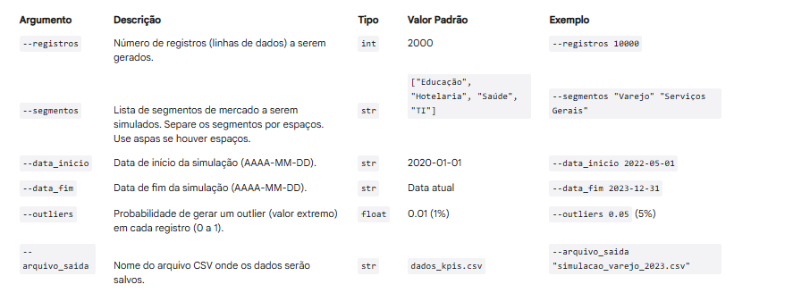

# 📖 Manual do Usuário - Gerador de Dados de KPIs SUPER 🚀

Este manual detalha como usar o script Python para gerar dados de KPIs empresariais.

## 1. Introdução

O script `main.py` é uma ferramenta flexível para criar dados sintéticos (fictícios, mas realistas) de KPIs.  Ele permite que você simule o desempenho de empresas em diferentes cenários, variando parâmetros como:

- Número de registros (linhas de dados).
- Segmentos de mercado.
- Período de tempo.
- Probabilidade de outliers (valores extremos).

Os dados gerados são salvos em um arquivo CSV, que pode ser facilmente importado em planilhas, ferramentas de BI (Business Intelligence) ou usado como entrada para simuladores e modelos de machine learning.

## 2. Pré-requisitos

Antes de usar o script, você precisa:

- **Python 3:** Ter o Python 3 instalado (versão 3.7 ou superior recomendada).
- **VSCode (ou outro editor):** Ter um editor de código instalado (VSCode é recomendado).
- **Bibliotecas:** Instalar as bibliotecas Python necessárias (veja a seção "Instalação" abaixo).
- **Ambiente Virtual:** Ter um ambiente ativado.

## 3. Instalação

1. **Crie um ambiente virtual (altamente recomendado):**

    Isso isola as dependências do projeto, evitando conflitos.  Abra um terminal na pasta do projeto (`projeto_kpis`) e execute:

      python -m venv venv

    - Windows

     .\venv\Scripts\activate

    - Linux/macOS

    source venv/bin/activate

2. **Instale as bibliotecas:**

    Com o ambiente virtual *ativo*, execute:

    pip install faker numpy

## 4. Execução do Script

O script é executado a partir da linha de comando (terminal).  Você pode executá-lo de duas formas:

### 4.1. Sem Argumentos (Valores Padrão)

        python main.py

Isso gera um arquivo chamado dados_kpis.csv com as seguintes configurações padrão:

- Número de registros: 2000

- Segmentos: "Educação", "Hotelaria", "Saúde", "TI"

- Data de início: 2020-01-01

- Data de fim: A data atual (quando você executa o script)

- Outliers: 1% de chance (0.01)

### 4.2. Com Argumentos (Personalizado)

    python main.py --registros 5000 --segmentos "Varejo" "Finanças" --data_inicio 2023-01-01 --data_fim 2023-12-31 --outliers 0.05 --arquivo_saida "meus_dados.csv"

Este exemplo gera:

- 5000 registros.

- Segmentos "Varejo" e "Finanças".

- Dados de 2023-01-01 a 2023-12-31.

- 5% de chance de outliers.

- Salva no arquivo "meus_dados.csv".

### Argumentos Disponíveis

### Ver todos os argumentos

python main.py --help

## 5. Exemplo de Registro (Linha do CSV)

1893,2022-01-01,2022,1,1,Varejo,Duarte e Filhos,Fonseca do Ferraz,63.06,12.96,816.94,748.45,68.49,9.75,14.6,18.36,92.86,1018.35,347.8,790.3,94.7,1.045,595.7

### Explicação das colunas

## 6. Dicas

- Experimente! Varie os argumentos para gerar diferentes conjuntos de dados.

- Analise os dados: Use planilhas (Excel, Google Sheets) ou bibliotecas Python (Pandas) para explorar os dados gerados.

- Valide os resultados: Verifique se os dados fazem sentido para os segmentos simulados.

- Comece com configurações simples: Use os valores padrão ou poucos argumentos no início. Depois, adicione mais complexidade.
