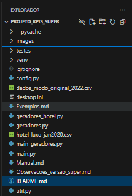
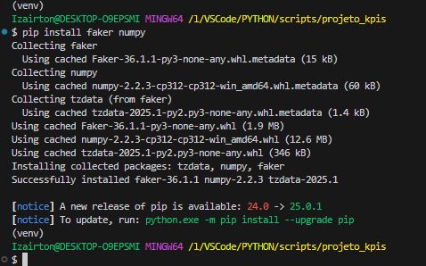
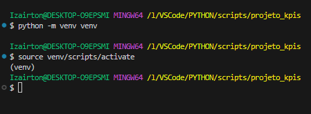
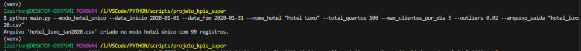
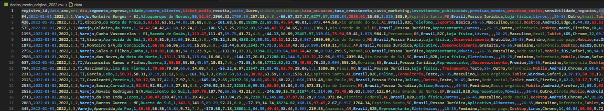
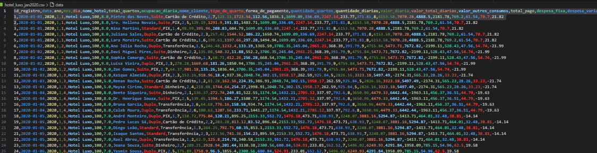

# 📊 Gerador de Dados de KPIs Empresariais com Python 🐍

## 🎯 Objetivo

Este projeto foi desenvolvido para gerar dados sintéticos (fictícios, porém realistas) de KPIs (Indicadores-Chave de Desempenho) para empresas de diversos segmentos, com especial ênfase no setor hoteleiro e Revenue Management. A ferramenta serve para:

- **Aprendizado e Experimentação:** Permite que estudantes, analistas e pesquisadores explorem cenários simulados sem depender de dados reais.
- **Desenvolvimento de Dashboards:** Fornece datasets para criação de dashboards interativos em ferramentas como Tableau, Power BI, etc.
- **Simulação de Negócios e Revenue Management:** Permite testar o impacto de estratégias, analisar indicadores financeiros e operacionais, e avaliar a performance de hotéis com métricas como ADR, RevPAR, TRevPAR e GOPPAR.
- **Teste de Hipóteses e Treinamento de Modelos:** Os dados podem ser utilizados para treinar modelos de previsão e realizar análises avançadas.

O projeto foi ampliado para suportar **duas modalidades de geração de dados**:

1. **Modo Original:** Geração de dados agregados para diversos segmentos – cada linha representa um registro (empresa/dia) com um conjunto extenso de KPIs.
2. **Modo Hotel Único:** Geração de dados detalhados para um único hotel – cada linha representa um cliente individual, e o sistema calcula, para cada dia, métricas diárias agregadas essenciais para Revenue Management.

## 🏗️ Estrutura do Projeto

O projeto é modular e composto pelos seguintes arquivos:

- **main.py:**  
  Script principal que orquestra a geração dos dados. Processa os argumentos de linha de comando e decide qual modo utilizar (Modo Original ou Modo Hotel Único), chamando as funções correspondentes e salvando os resultados em um arquivo CSV.

- **geradores.py:**  
  Contém funções para gerar dados sintéticos para o modo original (diversos segmentos), incluindo métricas financeiras, operacionais, de marketing, satisfação, etc. Este modo gera registros agregados (uma linha por registro/empresa).

- **geradores_hotel.py:**  
  Contém as funções para gerar dados detalhados para um único hotel. Cada linha representa um cliente e, além dos dados individuais (nome do cliente, tipo de quarto, diárias, consumos, etc.), este módulo calcula e acrescenta métricas diárias agregadas para Revenue Management, tais como:
  - **quartos_ocupados_dia:** Número total de quartos alugados no dia.
  - **receita_quartos_dia:** Soma dos valores totais das diárias dos clientes (receita dos quartos).
  - **receita_total_dia:** Soma dos valores pagos (diárias + outros consumos) de todos os clientes.
  - **custo_total_dia:** Soma das despesas diárias (fixas, variáveis, mão de obra, financeiras, administrativas).
  - **lucro_operacional_bruto_dia:** Diferença entre receita_total_dia e custo_total_dia.
  - **adr_dia:** Average Daily Rate (receita_quartos_dia / quartos_ocupados_dia).
  - **revpar_dia:** Revenue per Available Room (receita_quartos_dia / total_quartos).
  - **trevpar_dia:** Total Revenue per Available Room (receita_total_dia / total_quartos).
  - **goppar_dia:** Gross Operating Profit per Available Room (lucro_operacional_bruto_dia / total_quartos).

- **util.py:**  
  Fornece funções utilitárias, como a função para criar e gravar arquivos CSV.

- **testes/** (opcional):  
  Pasta com testes unitários (por exemplo, `test_geradores.py`) para garantir a qualidade do código.

## 🗂️ Fluxo de Dados e Funcionalidades

### 1. Configuração e Execução

#### Parâmetros Comuns (Modo Original e Modo Hotel Único)

- `--data_inicio` e `--data_fim`: Define o período para geração dos dados.
- `--outliers`: Probabilidade de aplicação de outliers (por exemplo, 0.01 para 1%).
- `--arquivo_saida`: Nome do arquivo CSV onde os dados serão salvos.

#### Parâmetros Específicos

- **Modo Original:**
  - `--registros`: Número de registros (linhas) a serem gerados.
  - `--segmentos`: Lista de segmentos para os quais os dados serão criados (ex.: "Varejo", "Finanças", "Hotelaria", "TI", etc.).

- **Modo Hotel Único:**
  - `--modo_hotel_unico`: Flag para habilitar o modo detalhado de um único hotel.
  - `--nome_hotel`: Nome do hotel (ex.: "Hotel Luxo").
  - `--total_quartos`: Capacidade total de quartos do hotel (valor configurável, não necessariamente 100).
  - `--max_clientes_por_dia`: Número máximo de clientes que podem se hospedar em um dia.

### 2. Geração dos Dados

- **Modo Original:**  
  Para cada registro, o script:
  - Gera uma data aleatória e escolhe um segmento.
  - Cria dados gerais (empresa, cidade, etc.) com Faker.
  - Calcula diversos KPIs (número de clientes, ticket médio, receita, custo, lucro, etc.) usando distribuições estatísticas e, opcionalmente, autocorrelação.
  - Aplica outliers conforme a probabilidade configurada.

- **Modo Hotel Único:**  
  Para cada dia do período:
  - São gerados registros individuais para cada cliente (até o número máximo especificado, respeitando a limitação de quartos).
  - Cada registro inclui informações individuais do cliente (nome, tipo de quarto, quantidade de diárias, etc.) e os valores financeiros correspondentes.
  - Despesas diárias (fixa, variável, mão de obra, financeira e administrativa) são geradas uma vez por dia e replicadas em cada registro daquele dia.
  - Após gerar os registros do dia, o script calcula as métricas diárias agregadas (quartos ocupados, receita de quartos, receita total, custo total, lucro operacional bruto, ADR, RevPAR, TRevPAR, GOPPAR) e as adiciona a cada registro.
  - Essas informações permitem que dashboards possam agrupar os dados por dia e analisar os KPIs de Revenue Management sem necessidade de cálculos adicionais.

### 3. Salvamento dos Dados

- Os dados são organizados em uma lista de listas e gravados em um arquivo CSV com um cabeçalho apropriado, utilizando a função `criar_arquivo_csv` do módulo **util.py**.

## 💻 Tecnologias e Bibliotecas Utilizadas

- **Python 3:** Linguagem principal.
- **csv:** Para criação e manipulação de arquivos CSV.
- **random:** Para geração de números aleatórios.
- **datetime:** Para manipulação de datas.
- **Faker:** Para gerar dados fictícios realistas (nomes de empresas, clientes, cidades, etc.).
- **numpy:** Para gerar números com distribuições estatísticas (normal, lognormal).
- **argparse:** Para processamento de argumentos de linha de comando.
- **unittest** (opcional): Para testes unitários.

## 🚀 Modo de Uso

### 1. Pré-requisitos

- Python 3.7 ou superior.
- Ambiente virtual (recomendado).
- Instalar as dependências:

  pip install faker numpy

### 2. Criar e Ativar Ambiente Virtual

- **No Terminal**

python -m venv venv

- **Ativar**

- No Windows
  .\venv\Scripts\activate
- Linux/macOS:
  source venv/bin/activate

### 3. Executar o Script

Modo Original (Dados Agregados por Empresa/Segmento)

- **Exemplo:**

python main.py --registros 5000 --segmentos "Aviação" "Finanças" "Metalurgia" "Automobilismo" "Hospital" "Saúde" "TI" \
    --data_inicio 2020-01-01 --data_fim 2024-12-31 --outliers 0.05 --arquivo_saida "dados_segmentados_2020_2024.csv"

Modo Hotel Único (Dados Detalhados para um Único Hotel com Métricas Diárias para Revenue Management)

- **Exemplo:**

python main.py --modo_hotel_unico --data_inicio 2020-01-01 --data_fim 2020-01-31 \
    --nome_hotel "Hotel Luxo" --total_quartos 120 --max_clientes_por_dia 5 --outliers 0.02 \
    --arquivo_saida "hotel_luxo_jan2020.csv"

### 4. Visualização do CSV

- **No Modo Original:**

    O CSV conterá colunas como registro_id, data, ano, mes, dia, segmento, empresa, cidade e um conjunto extenso de KPIs (clientes, receita, custos, lucros, marketing, despesas, etc.).

- **No Modo Hotel Único:**

    O CSV conterá as seguintes 31 colunas:
    1. id_registro: Identificador sequencial do registro (cliente).
    2. data: Data do registro (YYYY-MM-DD).
    3. ano: Ano extraído da data.
    4. mes: Mês extraído da data.
    5. dia: Dia do mês.
    6. nome_hotel: Nome do hotel (fixo para todo o dataset).
    7. total_quartos: Capacidade total de quartos do hotel.
    8. ocupacao_diaria: Percentual de ocupação do dia (calculado a partir do número total de quartos alugados).
    9. nome_cliente: Nome fictício do hóspede.
    10. tipo_de_quarto: Categoria do quarto alugado (ex.: Standard, Duplo, Suite).
    11. forma_de_pagamento: Método de pagamento (ex.: Cartão de Crédito, Dinheiro, PIX).
    12. quantidade_quartos: Número de quartos alugados pelo cliente.
    13. quantidade_diarias: Número de diárias contratadas.
    14. valor_diaria: Valor cobrado por diária.
    15. valor_total_diarias: Valor total das diárias (quantidade_quartos × quantidade_diarias × valor_diaria).
    16. valor_outros_consumos: Gastos extras do cliente (ex.: restaurante, minibar).
    17. total_pago: Soma de valor_total_diarias e valor_outros_consumos.
    18. despesa_fixa: Despesa fixa diária do hotel.
    19. despesa_variavel: Despesa variável diária.
    20. despesa_mao_obra_direta: Custos com mão de obra diretamente envolvidos.
    21. despesa_financeira: Despesas financeiras do dia (juros, taxas).
    22. despesa_administrativa: Custos administrativos do dia.
    23. quartos_ocupados_dia: Número total de quartos alugados no dia.
    24. receita_quartos_dia: Soma dos valores totais das diárias dos clientes (receita de quartos).
    25. receita_total_dia: Soma de todos os valores pagos pelos clientes (diárias + outros consumos).
    26. custo_total_dia: Soma das despesas diárias do hotel.
    27. lucro_operacional_bruto_dia: Diferença entre receita_total_dia e custo_total_dia.
    28. adr_dia: Average Daily Rate – receita_quartos_dia dividida por quartos_ocupados_dia.
    29. revpar_dia: Revenue per Available Room – receita_quartos_dia dividida pelo total de quartos.
    30. trevpar_dia: Total Revenue per Available Room – receita_total_dia dividida pelo total de quartos.
    31. goppar_dia: Gross Operating Profit per Available Room – lucro_operacional_bruto_dia dividido pelo total de quartos.

Essas colunas agregadas permitem uma análise completa dos KPIs diários e são essenciais para dashboards de Revenue Management.

## 🗂️ Estrutura de Pastas

## 🚀 Clonando o Repositório

git clone <https://github.com/IOVASCON/projeto_csv_super.git>

## 🖼️ Imagens do Desenvolvimento

1. Dependências do Projeto:

    

2. Ambiente Virtual:

    

3. Execução do Script:

    

4. Exemplo do CSV Gerado (Modo Original):

    

5. Exemplo do CSV Gerado (Modo Hotel Único):

    

## 🤝 Contribuições

Contribuições são muito bem-vindas! Se você encontrar problemas ou tiver sugestões de melhorias:

- Abra uma issue para relatar o problema ou sugerir novas funcionalidades.
- Envie um pull request com suas contribuições.

## 👤 Autor

[Izairton] - [IOVASCON](https://github.com/IOVASCON)

## ✨ Melhorias Futuras

- Adicionar KPIs específicos para novos segmentos.
- Implementar modelos de séries temporais mais sofisticados (ex.: ARIMA, Prophet).
- Desenvolver uma interface gráfica (GUI).
- Ampliar os testes unitários.
- Suporte para exportar dados em outros formatos (JSON, Parquet).
- Refinar a lógica de cálculo de despesas e de ocupação, especialmente no modo hotel único.
